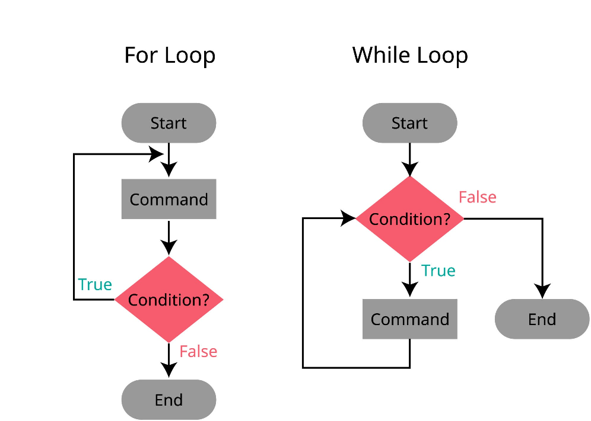

## **Software Requirements Specification (SRS)**

**Título do Projeto: Game 3D – Aventuras no Mundo XYZ**

---

## **1. Introdução**

### **1.1 Propósito**

Este documento tem como objetivo definir de maneira completa e detalhada os requisitos funcionais e não funcionais do jogo 3D "Aventuras no Mundo XYZ". Ele serve como base para desenvolvedores, designers, equipe de QA e stakeholders envolvidos no projeto.

### **1.2 Escopo**

O sistema consiste em um jogo eletrônico 3D em que o jogador controla um personagem explorando um mundo aberto, realizando missões, interagindo com objetos, enfrentando inimigos e evoluindo no progresso da história. O jogo será desenvolvido utilizando uma engine 3D moderna (Unity ou Unreal Engine).

### **1.3 Definições, Acrônimos e Abreviações**

* **NPC** – Personagem não jogável.
* **HUD** – Heads-Up Display (interface exibida ao jogador).
* **IA** – Inteligência artificial.
* **RF** – Requisito Funcional.
* **RNF** – Requisito Não Funcional.
* **SRS** – Software Requirements Specification.

---

## **2. Descrição Geral**

### **2.1 Perspectiva do Produto**

O jogo é um sistema independente, com componentes internos como:

* Gerenciador de Física
* Gerenciador de Cena
* Sistema de Inventário
* Sistema de IA
* Sistema de Missões
* Motor de Renderização 3D

### **2.2 Funções do Sistema**

O sistema permitirá:

* Controle total do personagem em 3D
* Exploração do ambiente
* Interação com objetos
* Combate
* Realização de missões
* Gerenciamento de inventário
* Salvamento e carregamento de progresso

### **2.3 Usuários do Sistema**

* **Jogadores iniciantes**
* **Jogadores avançados**
* **Testadores (QA)**
* **Desenvolvedores**

### **2.4 Restrições**

* O jogo deve rodar em hardware mínimo pré-definido.
* Deve seguir boas práticas de modelagem e otimização 3D.

---

## **3. Requisitos Funcionais**

### **RF01 – Controle do Personagem**

O sistema deve permitir ao jogador mover o personagem em todas as direções, pular, correr e realizar ações básicas.

### **RF02 – Câmera 3D**

A câmera deve acompanhar o personagem ou ser controlada pelo jogador através do mouse ou analógico.

### **RF03 – Interação com Objetos**

O sistema deve permitir que o jogador colete itens, abra portas, ative botões e interaja com elementos do ambiente.

### **RF04 – Sistema de Inventário**

O sistema deve armazenar, adicionar e remover itens coletados pelo jogador.

### **RF05 – Combate**

O sistema deve permitir que o jogador ataque, defenda-se e utilize habilidades quando em combate.

### **RF06 – Inteligência Artificial (NPCs)**

NPCs devem realizar ações como patrulhar, dialogar e reagir à presença do jogador.

### **RF07 – Inimigos e IA Hostil**

Inimigos devem ser capazes de detectar o jogador, perseguir e atacar.

### **RF08 – Sistema de Missões**

O jogo deve apresentar objetivos ao jogador, registrar progresso e desbloquear novas missões.

### **RF09 – HUD e Painéis**

A interface deve exibir vida, energia, minimapa, itens e notificações.

### **RF10 – Sistema de Física**

O sistema deve aplicar física realista ao personagem, objetos e ambiente.

### **RF11 – Colisões**

O jogo deve detectar colisões entre personagem, objetos, inimigos e cenários.

### **RF12 – Áudio 3D**

O sistema deve reproduzir sons de acordo com a distância e direção do jogador.

### **RF13 – Sistema de Salvamento**

O jogador deve poder salvar e carregar seu progresso.

### **RF14 – Menu Principal e Ajustes**

O jogo deve apresentar menu inicial, opções de áudio, vídeo, controles e saída.

### **RF15 – Spawn de Objetos e Inimigos**

O sistema deve permitir o surgimento de inimigos e itens conforme eventos do jogo.

---

## **4. Requisitos Não Funcionais**

### **RNF01 – Desempenho**

O jogo deve manter no mínimo 30 FPS em hardware mínimo.

### **RNF02 – Usabilidade**

A interface deve ser intuitiva e clara para o usuário.

### **RNF03 – Confiabilidade**

O sistema deve evitar falhas e permitir recuperação através do sistema de save.

### **RNF04 – Portabilidade**

O jogo deve rodar em Windows e plataformas adicionais opcionais (Linux, consoles).

### **RNF05 – Segurança**

Dados de save devem ser protegidos contra corrupção.

### **RNF06 – Escalabilidade**

O sistema deve permitir adição futura de mapas, personagens e missões.

---

## **5. Diagramas e Modelos (Opcional)**

* Diagrama de Casos de Uso
* Diagrama de Classes
* Fluxo de Missões
* Arquitetura do Sistema

*(Pode ser adicionado mediante solicitação.)*

---

## **6. Critérios de Aceitação**

* O jogador consegue iniciar, jogar e finalizar uma missão.
* Toda interação essencial deve funcionar sem falhas.
* O jogo deve carregar e salvar dados corretamente.
* O combate deve ser funcional e equilibrado.
* O desempenho mínimo deve ser atendido.

---

## **7. Versões do Documento**

* **v1.0** – Documento inicial gerado

---

# 🕒 Workshop: Event Storming Big Picture – Game 3D "Aventuras no Mundo XYZ"
**Objetivo:** Mapear o fluxo principal de gameplay e as reações do sistema para validar os Requisitos Funcionais (RF) e identificar gargalos (Hot Spots).
**Duração:** 50 Minutos.
**Participantes Sugeridos:** Game Designers, Devs (Gameplay & Engine), QA, Stakeholders.

---

## 🛠️ Preparação (Pré-Workshop)
Antes de iniciar o cronômetro, certifique-se de que a **Legenda** esteja visível para todos (no quadro branco ou ferramenta online como Miro/Mural).

**Legenda do Domínio (Conforme fornecido):**
* 🟧 **Evento (Laranja):** Fato ocorrido (Verbo no passado). Ex: `Inimigo Derrotado`.
* 🟦 **Comando (Azul):** Ação/Intenção do usuário ou sistema. Ex: `Atacar Inimigo`.
* 🟨 **Ator (Amarelo):** Quem executa (Jogador, NPC, Sistema de Física).
* 🟩 **Read Model (Verde):** O que é visto na tela (HUD, Inventário).
* 🟪 **Política (Roxo):** Regra de negócio/lógica (Se X, então Y).
* 🔴 **Hot Spot (Vermelho):** Risco, dúvida ou problema.

---

## 🚀 Etapas do Workshop (Cronograma)

### 1. Contextualização Rápida (00:00 - 05:00)
**Ação:** O facilitador lê o **Escopo (1.2)** e os **Objetivos**.
**Foco:** Deixar claro que estamos modelando a experiência de "Explorar -> Combater -> Evoluir".
**Instrução:** "Não vamos debater código agora (classes C++ ou C#), vamos debater o *comportamento* do jogo."

### 2. Chaotic Exploration: Eventos de Domínio (05:00 - 15:00)
**Técnica:** Brainstorming Silencioso + Colagem.
**Instrução:** "Baseado no SRS, escrevam em post-its laranjas tudo o que acontece no jogo **no passado**. O que o sistema registra?"

**Mapeamento com a SRS:**
* *Jogadores:* `Jogo Iniciado`, `Missão Aceita` (RF08), `Item Coletado` (RF03), `Dano Recebido`.
* *Sistema:* `Colisão Detectada` (RF11), `Jogo Salvo` (RF13), `Inimigo Spawnado` (RF15).

> **Dica do Facilitador:** Se alguém escrever "Atacar", corrija para "Dano Causado" ou "Ataque Realizado". Eventos são fatos consumados.

### 3. Enforce the Timeline: Ordenação Temporal (15:00 - 25:00)
**Ação:** Organizar os post-its laranjas em uma linha do tempo lógica da esquerda para a direita.
**Estrutura da Raia (Gameplay Loop):**
1.  **Start:** Menu / Carregamento (RF14).
2.  **Exploração:** Movimentação e Física (RF01, RF10).
3.  **Encontro:** Detecção de Inimigo (RF07).
4.  **Combate:** Troca de danos (RF05).
5.  **Recompensa:** Loot / Inventário (RF04).
6.  **Desfecho:** Save / Missão Concluída.

### 4. Comandos e Atores (25:00 - 35:00)
**Instrução:** "O que gatilha esses eventos? Quem faz isso acontecer?"
**Ação:** Adicionar post-its **Azuis (Comandos)** e **Amarelos (Atores)** antes dos eventos.

* **Exemplo de Fluxo (Combate - RF05):**
    * 🟨 **Ator:** Jogador
    * 🟦 **Comando:** `Pressionar Botão de Ataque`
    * 🟧 **Evento:** `Animação de Ataque Iniciada` -> `Colisão Detectada` (RF11) -> `Dano Calculado`.

* **Exemplo de Fluxo (IA - RF06):**
    * 🟨 **Ator:** NPC Hostil
    * 🟦 **Comando:** `Detectar Jogador` (Trigger automático)
    * 🟧 **Evento:** `Modo Perseguição Ativado`.

### 5. Políticas e Modelos de Leitura (35:00 - 45:00)
**Instrução:** "Como o jogador sabe o que está acontecendo (Read Model)? E quais regras governam isso (Políticas)?"
**Ação:** Adicionar post-its **Verdes** e **Roxos**.

* **RF09 (HUD):** Após o evento `Dano Recebido`, adicionamos o Read Model 🟩 `Barra de Vida Atualizada`.
* **RF04 (Inventário):** Entre o comando `Coletar Item` e o evento `Item Adicionado`, existe uma Política 🟪: *"O inventário possui espaço?"*.
* **RNF01 (Desempenho):** Política 🟪 *"Se houver muitos inimigos (RF15), aplicar culling ou reduzir IA"* (Link com o texto do processo de "Deus 1 e Deus 2").

### 6. Review e Hot Spots (45:00 - 50:00)
**Ação:** Caminhar do início ao fim do fluxo e marcar problemas com post-its **Vermelhos** 🔴.

**Perguntas de Verificação (Baseadas nos Critérios de Aceitação):**
1.  *Onde o jogo pode travar (Crash)?* (RNF03)
2.  *O fluxo de Missão (RF08) está claro ou o jogador fica perdido?*
3.  *Existe conflito entre a Física (RF10) e o Combate (RF05)?*
4.  *O Save (RF13) salva o estado exato da missão ou apenas a posição?*

---

## Exemplo Prático do Resultado Final (Trecho do Quadro)

Aqui está como um trecho do quadro deve se parecer ao final dos 50 minutos, focado no **Combate (RF05)** e **Física (RF10)**:

| Ator 🟨 | Comando 🟦 | Política 🟪 | Evento 🟧 | Read Model 🟩 |
| :--- | :--- | :--- | :--- | :--- |
| **Jogador** | `Mover para frente` | *Física Realista (RF10)* | `Posição Atualizada` | `Câmera Ajustada` (RF02) |
| **Inimigo** | `Detectar Jogador` | *Raio de Visão < 10m* | `Jogador Detectado` | `Ícone de Alerta no HUD` |
| **Jogador** | `Atacar` | *Cooldown da Arma zerado?* | `Dano Causado` | `Barra de Vida Inimigo -10` |
| **Sistema** | `Verificar Vida` | *Se Vida <= 0* | `Inimigo Morto` | `Loot Dropado` (RF15) |

---

