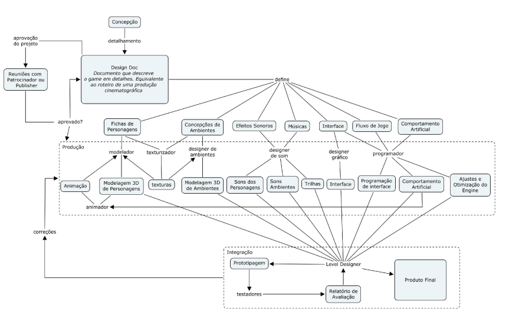

# Workshop: O Pipeline de Desenvolvimento de Games 3D

**Objetivo:** Mapear o fluxo de criação de um jogo 3D, identificando gargalos de processamento, regras de otimização e a emergência de comportamentos complexos.

## **Software Requirements Specification (SRS)**

**Título do Projeto: Game 3D – Aventuras no Mundo XYZ**

---

## **1. Introdução**

### **1.1 Propósito**

Este documento tem como objetivo definir de maneira completa e detalhada os requisitos funcionais e não funcionais do jogo 3D "Aventuras no Mundo XYZ". Ele serve como base para desenvolvedores, designers, equipe de QA e stakeholders envolvidos no projeto.

### **1.2 Escopo**

O sistema consiste em um jogo eletrônico 3D em que o jogador controla um personagem explorando um mundo aberto, realizando missões, interagindo com objetos, enfrentando inimigos e evoluindo no progresso da história. O jogo será desenvolvido utilizando uma engine 3D moderna (Unity ou Unreal Engine).

### **1.3 Definições, Acrônimos e Abreviações**

* **NPC** – Personagem não jogável.
* **HUD** – Heads-Up Display (interface exibida ao jogador).
* **IA** – Inteligência artificial.
* **RF** – Requisito Funcional.
* **RNF** – Requisito Não Funcional.
* **SRS** – Software Requirements Specification.

---

## **2. Descrição Geral**

### **2.1 Perspectiva do Produto**

O jogo é um sistema independente, com componentes internos como:

* Gerenciador de Física
* Gerenciador de Cena
* Sistema de Inventário
* Sistema de IA
* Sistema de Missões
* Motor de Renderização 3D

### **2.2 Funções do Sistema**

O sistema permitirá:

* Controle total do personagem em 3D
* Exploração do ambiente
* Interação com objetos
* Combate
* Realização de missões
* Gerenciamento de inventário
* Salvamento e carregamento de progresso

### **2.3 Usuários do Sistema**

* **Jogadores iniciantes**
* **Jogadores avançados**
* **Testadores (QA)**
* **Desenvolvedores**

### **2.4 Restrições**

* O jogo deve rodar em hardware mínimo pré-definido.
* Deve seguir boas práticas de modelagem e otimização 3D.

---

## **3. Requisitos Funcionais**

### **RF01 – Controle do Personagem**

O sistema deve permitir ao jogador mover o personagem em todas as direções, pular, correr e realizar ações básicas.

### **RF02 – Câmera 3D**

A câmera deve acompanhar o personagem ou ser controlada pelo jogador através do mouse ou analógico.

### **RF03 – Interação com Objetos**

O sistema deve permitir que o jogador colete itens, abra portas, ative botões e interaja com elementos do ambiente.

### **RF04 – Sistema de Inventário**

O sistema deve armazenar, adicionar e remover itens coletados pelo jogador.

### **RF05 – Combate**

O sistema deve permitir que o jogador ataque, defenda-se e utilize habilidades quando em combate.

### **RF06 – Inteligência Artificial (NPCs)**

NPCs devem realizar ações como patrulhar, dialogar e reagir à presença do jogador.

### **RF07 – Inimigos e IA Hostil**

Inimigos devem ser capazes de detectar o jogador, perseguir e atacar.

### **RF08 – Sistema de Missões**

O jogo deve apresentar objetivos ao jogador, registrar progresso e desbloquear novas missões.

### **RF09 – HUD e Painéis**

A interface deve exibir vida, energia, minimapa, itens e notificações.

### **RF10 – Sistema de Física**

O sistema deve aplicar física realista ao personagem, objetos e ambiente.

### **RF11 – Colisões**

O jogo deve detectar colisões entre personagem, objetos, inimigos e cenários.

### **RF12 – Áudio 3D**

O sistema deve reproduzir sons de acordo com a distância e direção do jogador.

### **RF13 – Sistema de Salvamento**

O jogador deve poder salvar e carregar seu progresso.

### **RF14 – Menu Principal e Ajustes**

O jogo deve apresentar menu inicial, opções de áudio, vídeo, controles e saída.

### **RF15 – Spawn de Objetos e Inimigos**

O sistema deve permitir o surgimento de inimigos e itens conforme eventos do jogo.

---

## **4. Requisitos Não Funcionais**

### **RNF01 – Desempenho**

O jogo deve manter no mínimo 30 FPS em hardware mínimo.

### **RNF02 – Usabilidade**

A interface deve ser intuitiva e clara para o usuário.

### **RNF03 – Confiabilidade**

O sistema deve evitar falhas e permitir recuperação através do sistema de save.

### **RNF04 – Portabilidade**

O jogo deve rodar em Windows e plataformas adicionais opcionais (Linux, consoles).

### **RNF05 – Segurança**

Dados de save devem ser protegidos contra corrupção.

### **RNF06 – Escalabilidade**

O sistema deve permitir adição futura de mapas, personagens e missões.

---

## **5. Diagramas e Modelos (Opcional)**

* Diagrama de Casos de Uso
* Diagrama de Classes
* Fluxo de Missões
* Arquitetura do Sistema

*(Pode ser adicionado mediante solicitação.)*

---

## **6. Critérios de Aceitação**

* O jogador consegue iniciar, jogar e finalizar uma missão.
* Toda interação essencial deve funcionar sem falhas.
* O jogo deve carregar e salvar dados corretamente.
* O combate deve ser funcional e equilibrado.
* O desempenho mínimo deve ser atendido.

---

## **7. Versões do Documento**

* **v1.0** – Documento inicial gerado

** MODELAGEM DE UM GAME 3D**

---

## PROCESSO DE ENVENT STORMING BIG PICTURE

**Participantes (Atores):**
* [cite_start]**Modelador 3D:** Responsável pela geometria[cite: 118].
* [cite_start]**Texturizador:** Responsável pelo visual das superfícies[cite: 119].
* [cite_start]**Animador:** Responsável pelo movimento e "peso"[cite: 135].
* [cite_start]**Programador (Deus 1):** Controla as leis da física e regras explícitas[cite: 586].
* [cite_start]**Programador de IA (Deus 2):** Define condições iniciais para emergência[cite: 594].

---

## 1. A Legenda (Adaptada ao Domínio)

| Cor do Post-it | Conceito | Significado neste Workshop |
| :--- | :--- | :--- |
| **Laranja** | **Event** | Algo aconteceu no motor gráfico ou no processo. Ex: "Polígono Renderizado", "Colisão Detectada". |
| **Azul** | **Command** | Ação do desenvolvedor ou do jogador. Ex: "Compilar Nível", "Mover Personagem". |
| **Roxo** | **Policy** | Regras de otimização/física citadas no texto. Ex: "Se distante, reduzir triângulos". |
| **Amarelo** | **Actor** | Quem executa (Modelador, Engine, Jogador). |
| **Verde** | **Read Model** | O que vemos na tela (FPS, Glitches, Aliasing). |

---

## 2. A Linha do Tempo (The Flow)

Vamos dividir o quadro em quatro raias principais baseadas nos capítulos da dissertação: **Modelagem**, **Texturização**, **Animação** e **Comportamento Artificial**.

### Raia 1: Modelagem e Otimização Geométrica
*Foco: Como representar formas complexas gastando pouco processamento.*

1.  [cite_start]**(Azul)** `Criar Esfera` $\rightarrow$ **(Roxo)** *Política de Eficiência:* Usar estrutura geodésica mantém a homogeneidade com menos triângulos[cite: 227, 229].
2.  **(Laranja)** Modelo criado com baixo polígono.
3.  [cite_start]**(Azul)** `Modelar Cilindro/Braço` $\rightarrow$ **(Roxo)** *Regra do Número Ímpar:* Cilindros com lados ímpares (ex: 3 ou 5) mantêm o volume visual melhor ao rotacionar do que lados pares[cite: 234, 238].
4.  **(Laranja)** Objeto Renderizado na Tela.
5.  [cite_start]**(Roxo)** *Política de Culling:* Se o objeto está fora do Fustrum (campo visual), não renderizar[cite: 270, 278].
6.  **(Laranja)** Objeto removido do processamento.
7.  [cite_start]**(Roxo)** *Política de LOD (Level of Detail):* Se o objeto está longe, trocar por modelo de baixa resolução[cite: 326].

---

### Raia 2: Texturização e "O Mito da Resolução"
*Foco: Qualidade visual versus memória.*

1.  **(Azul)** `Aplicar Textura 2048x2048` em objeto distante.
2.  [cite_start]**(Laranja)** Erro de Aliasing (Cintilação) Detectado[cite: 401].
3.  **(Verde)** Visualização: Imagem ruidosa e queda de performance.
4.  [cite_start]**(Roxo)** *Lei da Resolução:* Texturas grandes em áreas pequenas da tela geram imagens piores devido à escolha arbitrária de pixels[cite: 400, 378].
5.  [cite_start]**(Azul)** `Aplicar MIP Mapping` $\rightarrow$ **(Laranja)** Textura reduzida automaticamente conforme a distância[cite: 430].
6.  [cite_start]**(Roxo)** *Técnica de Iluminação:* Usar texturas para simular relevos (dobras de roupa) sem criar novos polígonos[cite: 338].

---

### Raia 3: Animação e Percepção
*Foco: O movimento engana o cérebro.*

1.  [cite_start]**(Verde)** Read Model: Modelo estático parece "feio" e angular[cite: 463].
2.  **(Laranja)** Personagem começou a mover-se.
3.  [cite_start]**(Roxo)** *Lei da Gestalt/Movimento:* O movimento delineia o objeto; a animação é mais crítica que a forma estática[cite: 472, 486].
4.  **(Azul)** `Simular Impacto no Chão`.
5.  [cite_start]**(Roxo)** *Técnica da Antecipação Invisível:* Dobrar o joelho ao contrário por 1 frame (erro intencional) cria a sensação de impacto/peso[cite: 554, 568].
6.  [cite_start]**(Laranja)** Movimento percebido como realista pelo cérebro[cite: 562].

---

### Raia 4: Inteligência Artificial e Emergência
*Foco: Programação explícita vs. Comportamento Emergente.*

1.  [cite_start]**(Azul)** `Definir Regra Simples`: "Se perto do amigo, agrupar. Se longe, atacar"[cite: 708].
2.  **(Laranja)** Soldados entram em loop de movimento.
3.  [cite_start]**(Laranja)** Comportamento Emergente: Soldados começam a "dançar" em círculos (efeito não planejado)[cite: 718].
4.  [cite_start]**(Azul)** `Aplicar Algoritmo Genético` (Tanque de Simulação)[cite: 766].
5.  [cite_start]**(Roxo)** *Função de Avaliação:* Maximizar Sobrevivência[cite: 800].
6.  [cite_start]**(Laranja)** Resultado da Evolução: Personagens covardes que fogem e se escondem perfeitamente (comportamento "barata")[cite: 802, 805].
7.  **(Azul)** `Ajustar Função de Avaliação` para maximizar dano + sobrevivência.

---

## 3. Diagrama de Fluxo Geral (Mapa do Processo)

Para finalizar o workshop, pode-se apresentar o mapa de processo utilizado pela própria *Perceptum Software*, que conecta todas essas raias.

[cite_start]Este diagrama [cite: 95] serve como o "Big Picture" final, mostrando como o **Design Doc** alimenta a modelagem e programação, que passam por integração e testes, onde os eventos de "Aliasing", "Baixa Performance" ou "Comportamento Estranho da IA" forçam o retorno às fases anteriores (Feedbacks Loops).

### Perguntas para provocar a discussão (Hot Spots):
* *Onde estamos gastando processamento inutilmente? (Modelos com muitos polígonos fora do Fustrum?)*
* *Nossa "Realidade" está convincente? (Precisamos melhorar a forma ou apenas a animação?)*
* *Estamos tentando programar tudo explicitamente ou permitindo comportamentos emergentes na IA?*